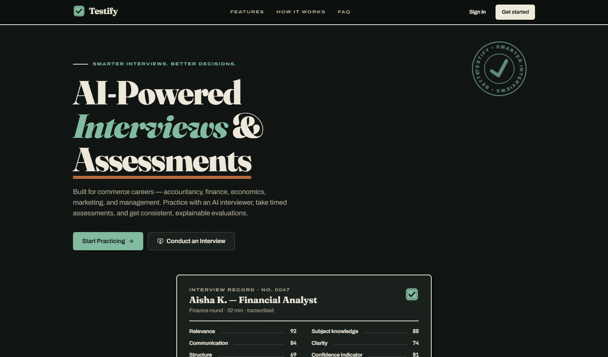
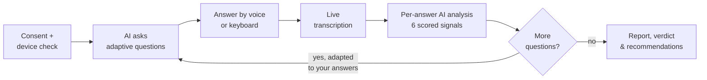

<div align="center">

# Testify

### *Smarter Interviews. Better Decisions.*

An AI-powered interview, mock-interview, assessment & candidate-evaluation platform.

[**Live Demo →**](https://testify-rose.vercel.app)


<br/><br/>



</div>

---

## What it does

Testify runs the **entire interview loop** in one place — candidates practice against an adaptive AI interviewer, interviewers run structured live interviews with synchronized tooling, and teams get consistent, explainable reports.

| 🎯 For candidates | 🎥 For interviewers | 🛡️ For admins |
|---|---|---|
| Adaptive AI mock interviews for 14+ roles | Live WebRTC interview rooms with screen share | Full user & role management |
| Spoken answers with live transcription | Synced questions, live transcript, notes & scoring | Platform analytics dashboards |
| Timed MCQ assessments with explanations | Question bank + MCQ bank with filters | Append-only audit logs |
| Per-answer AI analysis & progress charts | One-click candidate invitations | Server-verified role changes |
| Printable reports with verdict stamps | AI-aggregated or manual final results | Platform-wide settings |

## How an interview flows



Every answer is scored 0–100 on **relevance, technical accuracy, communication, clarity, structure**, and a **confidence indicator** — an honest composite of observable signals (pace, filler words, hesitation), never a claim about psychology. Optional in-browser video analysis reports *observable* signals only (camera presence, approximate eye contact) and requires its own separate consent.

## Architecture

```
React 18 + TypeScript + Vite ──► Supabase Auth (RLS-scoped JWT)
        │                              │
        │  supabase-js                 ▼
        ├────────────────► PostgreSQL — 16 tables, 55+ RLS policies,
        │                  SECURITY DEFINER RPCs (server-side MCQ scoring)
        │
        ├────────────────► Storage — 4 private/public buckets, path-scoped policies
        │
        ├────────────────► Realtime — presence, WebRTC signaling, live transcripts,
        │                  proctoring event streams
        │
        └──► 9 Edge Functions (Deno) ──► pluggable AI provider
             JWT verified in code        (any OpenAI-compatible API or Anthropic:
             rate-limited, audited        OpenAI, Groq, Gemini, OpenRouter…)
```

**Security posture:** authorization lives in the database (Row Level Security on every table), MCQ answer keys never reach the browser before submission, admin mutations are re-verified server-side, all AI keys exist only as edge-function secrets, and recording never starts without explicit consent.

## Tech stack

- **Frontend** — React 18, TypeScript (strict), Vite, Tailwind CSS, Radix primitives, Recharts, WebRTC, Web Speech API
- **Backend** — Supabase: Postgres + RLS, Auth, Storage, Realtime, Edge Functions (Deno)
- **AI** — provider-agnostic: any OpenAI-compatible endpoint (`OPENAI_BASE_URL`) or Anthropic; Whisper-compatible transcription
- **Design** — "Ink & Ledger": Fraunces + Archivo + JetBrains Mono, paper & ink palette, hard offset shadows, CVD-validated chart colors

## Quickstart

```bash
git clone https://github.com/SaudSatopay/testify.git
cd testify && npm install
cp .env.example .env          # add your Supabase URL + anon key
npm run dev
```

**On Windows?** Just double-click [`start-testify.bat`](start-testify.bat) — it checks for Node, installs dependencies, creates your `.env` on first run, and opens the app at `localhost:5173`.

**Backend setup** (one-time): apply `supabase/migrations/*.sql` + `supabase/seed.sql` to a Supabase project, deploy the functions in `supabase/functions/`, and set the edge secrets:

| Secret | Purpose |
|---|---|
| `OPENAI_API_KEY` | AI provider key (OpenAI, Groq, Gemini, OpenRouter…) |
| `OPENAI_BASE_URL` | optional — point at any OpenAI-compatible API |
| `AI_MODEL` / `WHISPER_MODEL` | optional model overrides |
| `APP_URL` | public URL used in invitation links |
| `RESEND_API_KEY` | optional — emails interview invitations |

The full step-by-step guide lives in [SETUP.md](SETUP.md). Without an AI key the platform still runs — MCQs, live interviews, and question-bank practice all work; AI features show an honest "not configured" state instead of fake results.

## Project structure

```
src/
├── pages/          public · candidate · interviewer · admin (lazy-loaded routes)
├── components/     interview room, editors, tables, reports, ui primitives
├── services/       data services, AI api client, WebRTC, recording,
│                   swappable VideoAnalysisService
├── hooks/          auth, media devices, speech recognition, proctoring
└── integrations/   typed Supabase client
supabase/
├── migrations/     schema, RLS policies, RPCs, storage, realtime
├── functions/      9 edge functions + shared AI provider abstraction
└── seed.sql        30 interview questions + 20 MCQs
```

---

<div align="center">

Built by **[Saud Satopay](https://github.com/SaudSatopay)**

*No recording ever starts without consent. AI signals are decision support — never the decision.*

</div>
